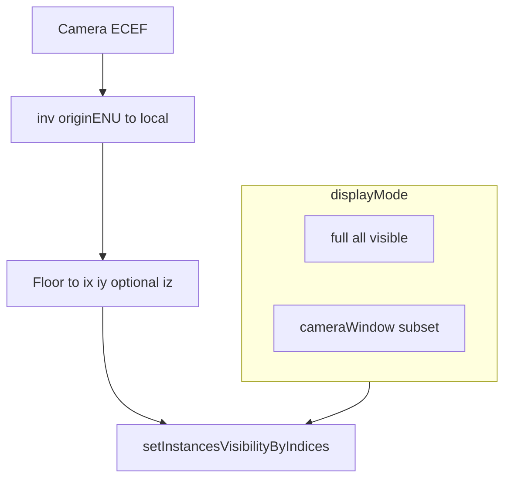

# 北斗格网显示模式：全量与近景相机窗口 LOD

## 1. 文档定位

本文档描述在**不改变格网生成与全局实例索引**的前提下，为大规模北斗格网增加两种**显示模式**的设计要点，重点解决：**相机贴近且格网仍很密**时，即便已采用「线框按屏幕尺度弱化」（见 [beidou-grid-wireframe-screen-scale.md](./beidou-grid-wireframe-screen-scale.md)），**屏幕上可见实例数**仍然过多、线框与半透明体叠加观感差的问题。

| 文档 | 主要手段 |
|------|----------|
| [beidou-grid-wireframe-screen-scale.md](./beidou-grid-wireframe-screen-scale.md) | 片元阶段用 `u_outlineMix` 调制线框在 `mix` 中的权重，**不减少实例** |
| **本文档** | 近景时按**相机在 ENU 下的格索引窗口**关闭大部分实例的 `instanceVisible`，**减少实际绘制的格元数** |

两种手段**可叠加**：远 / 中距主要靠线框弱化；近距密格可再启用窗口 LOD。

实现以仓库内 **Cesium 1.99.0**、`frontend/src/Rendering/BeiDouGridPrimitive.js`、`frontend/src/stores/map.js` 为准。

---

## 2. 背景与问题

### 2.1 现象

GPU 实例化路径下，每个格元仍是独立实例；片元线框近似**恒定像素线宽**。当用户**拉近**且 **dx、dy 仍较小**时，视锥内可见实例数量大，线框在像素层面仍易叠加，体量感被噪声淹没。

### 2.2 目标

- 提供可切换的 **全量显示** 与 **近景相机窗口（空间窗口）LOD**。
- **不重算** `createGridInstancesFromBounds` 输出的实例矩阵数据，**不修改**全局 `globalId` 与拾取编码规则。
- 通过已有 **per-instance `instanceVisible`** 通道控制是否参与主渲染（片元中 `discard`）。

### 2.3 非目标（本期）

- 改变后端离散格网划分或与分析服务一致的格元语义。
- 合并体素、减少实例数量的几何 LOD。
- 保证「窗口外」格元仍能被 GPU 拾取（需后续 CPU 拾取或独立方案，见第 6 节）。

---

## 3. 两种显示模式定义

| 模式工作名 | 含义 | 行为摘要 |
|------------|------|----------|
| `full`（全量） | 默认、与当前产品行为对齐 | 在未被业务掩膜、隐藏列表等逻辑剔除的前提下，所有实例 **`instanceVisible = 1`**（或仅由现有业务逻辑控制）；可继续启用 `u_outlineMix` 线框弱化。 |
| `cameraWindow`（近景窗口） | 可选 | 当满足第 4 节「靠近」判定时，仅保留以**相机在格网 ENU 局部坐标下**所落格索引为中心、水平（及可选垂向）扩展的 **W×H×(Z)** 窗口内实例为可见，其余 **`instanceVisible = 0`**；不满足「靠近」时**退化为与 `full` 相同**（全部可见，避免远距误杀）。 |

**说明**：「相机为原点」指在 **与格网一致的 ENU 局部坐标系**中，用相机位置（或投影点）换算到 **离散格索引 `(ix, iy, iz)`**，再以索引为单位扩展窗口；**不是**屏幕空间像素块，也不是以地球某固定点为原点的另一套网格。

---

## 4. 与当前实现对齐的事实

### 4.1 实例全局索引 `globalId`

与 `createGridInstancesFromBounds`（`frontend/src/Rendering/BeiDouGridPrimitive.js`）一致：

- `planeStride = gridX * gridY`
- 列索引 `colIndex = iy * gridX + ix`（`ix ∈ [0, gridX-1]`，`iy ∈ [0, gridY-1]`）
- **`globalId = iz * planeStride + colIndex`**，`iz ∈ [0, gridZ-1]`

与 `MapViewer.vue` 中点击解析一致：`iz = floor(globalId / layerSize)`，`rem = globalId % layerSize`，`iy = floor(rem / gridX)`，`ix = rem % gridX`，`layerSize = gridX * gridY`。

### 4.2 ENU 与局部坐标

- 格网使用 `Transforms.eastNorthUpToFixedFrame(originCartesian)` 得到 **`originENU`**（写入 `beiDouGridMeta.originENU`）。
- 实例世界矩阵为 **`originENU * T(localX, localY, localZ)`**，其中：
  - `localX = (ix + 0.5) * dx`，`localY = (iy + 0.5) * dy`
  - `localZ = zMin + (iz + 0.5) * dz + (groundH - originGroundHeight)`，`groundH` 为该列地形采样（见生成循环）

将世界坐标 `p_W`（如 `camera.positionWC`）变到与上述**同一局部定义**的向量，应使用：

`p_L = inverse(originENU) * p_W`（齐次点乘，`Cesium.Matrix4.inverse` + `multiplyByPoint`）。

### 4.3 可见性通道

- `BeiDouGridPrimitive` 主渲染片元着色器读取 **`instanceVisible`**，小于 0.5 则 **`discard`**。
- API：`setAllInstancesVisibility(visible)`、`setInstancesVisibilityByIndices(indices, visible)`（见 `BeiDouGridPrimitive.js`）。
- **不改变**实例矩阵与独立 **pick** 着色流程的 ID 编码；但若主通道不绘制该实例，拾取行为见第 6 节。

### 4.4 元数据入口

`map.js` 在 `showBeiDouGrid` 成功写入的 **`beiDouGridMeta`** 含：`gridX`、`gridY`、`gridZ`、`dx`、`dy`、`dz`、`zMin`、`zMax`、`originENU`、`renderMode` 等。

**仅当 `renderMode === 'instanced'`** 时，本方案描述的每实例可见性批量更新才有挂载点（与 `BeiDouGridPrimitive` 一致）。

---

## 5. 「靠近」判定（可配置）

建议同时支持**滞回**，减少边界抖动：

- 令 `d` 为相机到格网包围参考点的距离。实践中可直接使用 **`BeiDouGridPrimitive._boundingSphere` 中心**与 `camera.positionWC` 的欧氏距离（与现有线框弱化里对球心的用法一致），或使用 `beiDouGridMeta` 与场景包围的简化估计。
- **进入窗口模式**：`d < dEnter`
- **退出窗口模式（恢复全量可见）**：`d > dExit`，且 **`dExit > dEnter`**

可选：**与线框弱化共用信号**——例如仅当「典型格元屏幕像素宽度 `cellPx` 大于某阈值」（已经很密）且 `d < dEnter` 时才启用 `cameraWindow`，避免不必要的可见性抖动。具体阈值在实现阶段与产品共同确定。

---

## 6. 窗口 LOD 算法要点

### 6.1 相机落格索引（水平）

1. 计算 `p_L = inv(originENU) * camera.positionWC`。
2. 在水平面内，格元沿 X、Y 从 `0` 起每格宽度 `dx`、`dy`，与生成代码一致时，可用  
   **`ix = clamp(floor(p_L.x / dx), 0, gridX - 1)`**，**`iy = clamp(floor(p_L.y / dy), 0, gridY - 1)`**  
   （若相机落在格网 AABB 外，应先对 `p_L.x / p_L.y` 做边界裁剪或 clamp 到 `[0, gridX*dx)` / `[0, gridY*dy)` 再取 floor，避免窗口中心偏到网格外；细节在编码时与 `bounds` 对齐。）

### 6.2 垂向索引 `iz`（注意列间地面）

`localZ` 含 **`(groundH - originGroundHeight)`**，同一 `iz` 在不同 `(ix, iy)` 列上世界高度不同。单纯用 `p_L.z` 反推 `iz` 若忽略列地物，会与实例真实分层**错位**。

可选策略（实现时二选一并在代码注释中固定）：

- **策略 A（推荐先做）**：窗口仅在 **水平面** 上限制 **`ix, iy`**，垂向 **`iz` 全保留**（`0 … gridZ-1`），或仅在 `gridZ` 不大时接受开销。这样不会出现「列地面」导致的 `iz` 误判。
- **策略 B**：用相机下方列的 `groundH(ix_center, iy_center)` 近似，按生成式反解  
  `iz = clamp(round(((p_L.z - zMin - (groundH - originGroundHeight)) / dz - 0.5)), 0, gridZ-1)`，  
  仅在该列附近列误差可接受时使用。

以 `(ix0, iy0)`（及策略选定下的 `iz0`）为中心，扩展 **`[ix0 - rx, ix0 + rx]`** 等（与配置 `radiusX/radiusY/radiusZ` 对应），生成当前帧**应可见**的 `globalId` 集合。

### 6.3 与上一帧的差分更新

- 全量 `setAllInstancesVisibility` 在实例数极大时成本高。
- 建议维护**上一帧可见集合**，与本帧集合做**对称差分**，仅对**进入 / 离开**窗口的 `globalId` 调用 `setInstancesVisibilityByIndices`，减少 `DYNAMIC` 顶点缓冲写入量。

### 6.4 节流

- 每 **N** 帧更新一次，或相机相对上一采样点移动超过 **ε 米** 再重算，与线框方案类似，避免每帧全表扫描。

---

## 7. 拾取与交互

- Instanced 拾取走 **`activeBeiDouCellPrimitive.pick(scene, x, y)`**（见 `MapViewer.vue`），与 **主渲染同一套实例与可见性**。
- 主通道 **`instanceVisible < 0.5` 则 discard** 时，该实例**通常无法被 GPU 拾取命中**。

因此：

- **`cameraWindow` 模式下，用户点击窗口外区域时，可能无法选中该处格元**（与「未渲染」一致）。
- 若业务要求「看不见仍能点中」，需后续：**CPU 射线与格柱求交**、或**仅用于 pick 的不可见低开销层**等，本文档不规定具体实现。

---

## 8. 结果层与 `activeBeiDouCellPrimitive`

`map` store 中 **`activeBeiDouCellPrimitive`** 优先指向**分析结果层** Primitive（若存在且显示），否则为主格网 Primitive（见 getters 定义）。

实施窗口 LOD 时，**可见性更新必须与当前用于渲染与拾取的 Primitive 一致**，避免出现「画面是 A 层、拾取走 B 层」的错位。

---

## 9. 建议配置项

| 字段 | 含义 | 备注 |
|------|------|------|
| `displayMode` | `'full'` \| `'cameraWindow'` | 用户或高级设置切换 |
| `cameraWindowRadiusX` / `cameraWindowRadiusY` | 水平方向半宽（**格数**） | 如各为 2 表示约 5×5 列（含中心） |
| `cameraWindowRadiusZ` | 垂向半宽（格数）；可选「全层」 | 与第 6.2 节策略一致 |
| `cameraWindowDistanceEnter` | 进入近景窗口的距离阈值（米） | |
| `cameraWindowDistanceExit` | 退出近景窗口的距离阈值（米） | 必须大于 Enter |
| `cameraWindowUpdateThrottleFrames` | 节流帧数 | 可选 |
| `cameraWindowMinMoveMeters` | 相机移动超过该距离才更新窗口 | 可选 |

默认值由产品给定；开发阶段可用保守值验证功能。

---

## 10. 实现落点（文件级）

| 位置 | 说明 |
|------|------|
| `frontend/src/Rendering/BeiDouGridPrimitive.js` | 在 `update` 中或新增方法内，根据模式与相机状态更新 `_visibilityByBatch`；需能访问 `gridX/Y/Z`、`dx/dy/dz`、`originENU`（由构造 `options` 传入，或从外部每帧注入）。 |
| `frontend/src/stores/map.js` | 在 `postRender` / `camera.changed` 节流回调中计算索引并调用 primitive；或仅在 `showBeiDouGrid` 时注册、清除监听。 |
| `frontend/src/components/GridConfig.vue`（可选） | 模式开关与参数写入 store 或调用更新 API。 |

**注意**：`iz` 与地形相关的细节必须与 **`createGridInstancesFromBounds` 中 localZ 定义**严格一致，否则窗口与几何会错位。

---

## 11. 验收建议

1. **远距**：`cameraWindow` 未激活或等效全量时，观感与切换前一致（无大面积不可见）。
2. **近距**：进入距离阈值后，仅窗口内格元可见，线框密度主观可控；移动相机时窗口跟随，滞回与节流下无明显频闪。
3. **索引**：点击窗口内格元，`beidou-cell-ix-iy-iz` 与 `globalId` 互推与 `MapViewer` 逻辑一致。
4. **与线框弱化共存**：同时开启时无 shader / 崩溃错误。

---

## 12. 数据流示意

---

## 13. 小结

| 项目 | 说明 |
|------|------|
| 问题 | 近距密格时可见实例过多，线框仍易叠加 |
| 手段 | 近景按 ENU 格索引窗口关闭 `instanceVisible`；远距恢复全量 |
| 与线框弱化 | 片元 `u_outlineMix` 与实例可见性独立，可叠加 |
| 拾取 | 窗口外实例通常不可点，除非另做 CPU / 独立 pick |
| 主改方向 | `BeiDouGridPrimitive` 可见性 + `map`/相机驱动或 `options` 注入网格参数 |

本文档为设计说明；具体矩阵与边界公式以实现时代码与 Cesium 1.99 API 为准。
