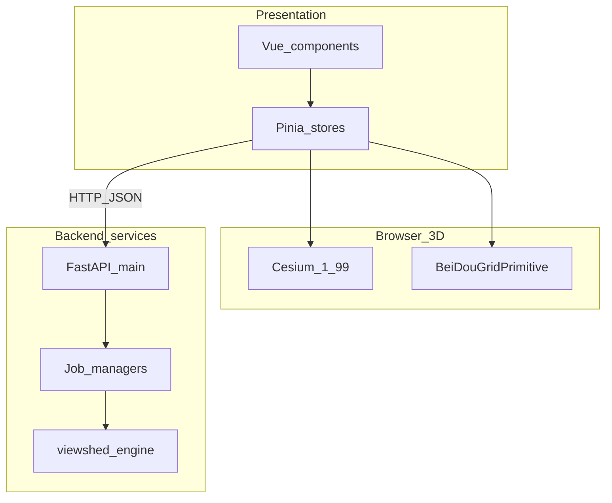
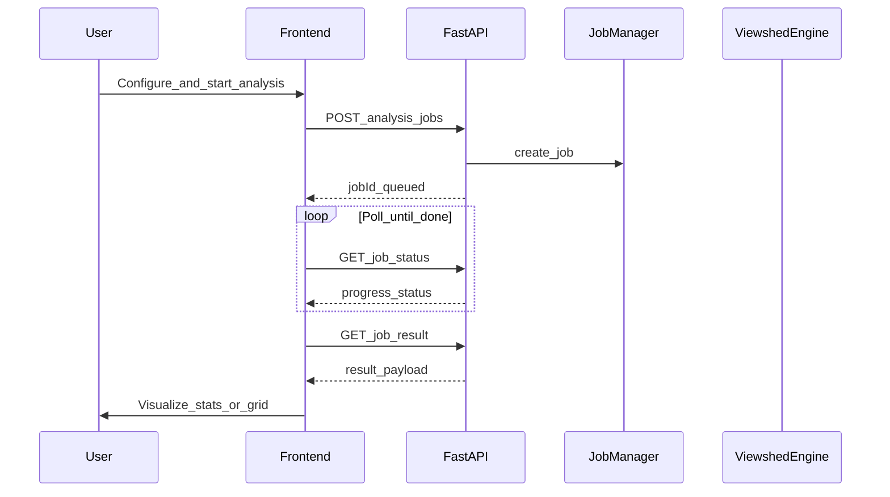
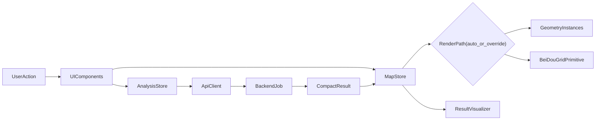
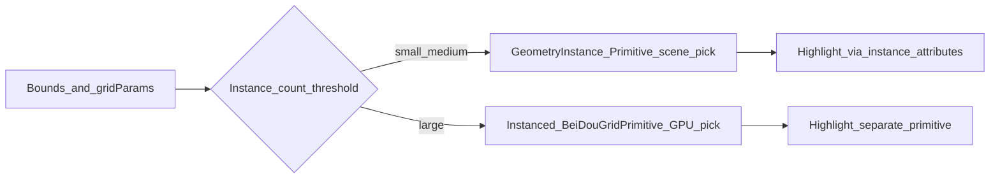

# 架构与数据流（论文叙述版）

面向毕业论文的**文字叙述**与**示意图**，可与 [04-系统功能与模块对照表.md](./04-系统功能与模块对照表.md) 配合使用。

---

## 1. 总体架构（文字）

系统采用**前后端分离**结构。**前端**为基于 Vue 3 的单页应用，负责三维地球可视化、人机交互、格网生成参数与站点数据管理；三维渲染引擎采用 **Cesium 1.99.0**，通过 WebGL 将地形、影像与自定义几何体绘制在浏览器中。**后端**基于 **FastAPI** 提供 RESTful API，承担 CPU 密集型的格网可视域（LOS）计算与柱掩膜等任务。前后端通过 HTTP（JSON）通信；分析类接口采用**异步作业**模式，前端通过轮询获取进度与最终结果，避免长连接阻塞。

> 说明：仓库 [docs/README.md](../README.md) 曾将后端描述为“扩展方向”，当前实现已包含分析与掩膜 API，**论文叙述建议以代码为准**。

---

## 2. 格网可视化数据流（文字）

用户首先确定二维范围（城市预设或 Shapefile 解析得到的经纬度 bbox），再配置三维方向上的分层参数（垂直方向 zMin/zMax 与 dz，水平方向 dx/dy，单位米）。前端在 `map` Store 中先执行数据准备：根据 bbox 反推 `gridX/gridY`，计算总格元规模，生成并缓存包含 `columnActive`、`groundHeights`、`gridMeta` 的数据集（缓存键含 bounds、步长、高度范围与裁剪哈希）。  

渲染阶段采用确定性分流：总格元数 `<= 120000` 时走 `GeometryInstance + Primitive`；`> 120000` 时走自定义 `BeiDouGridPrimitive`（instanced）。大规模路径共享单位盒体几何，仅上传实例矩阵并按 `65535` 上限自动拆批，避免单批实例溢出。用户点击时，中小规模路径通过 `scene.pick` 返回实例；大规模路径通过 `primitive.pick()` 离屏 ID 读回实例索引，再映射到 `(ix, iy, iz)` 与 `cellId`，高亮由独立 primitive 承担。

---

## 3. 可视域分析数据流（文字）

用户在前端确认站点列表与当前格网元数据（维度、步长、原点、地面高程栅格等），由 `analysis` Store 组装 `stations + gridMeta + params` 请求体提交后端创建作业。后端将作业放入管理器执行：在三维格点上对每个有效柱的每个高度层，筛选距离阈值内候选站点，并对候选链路执行 LOS 采样判断；过程中回调 `progress`。前端按约 `500ms` 周期轮询状态，`done` 后拉取结果负载。  

结果回写不是“整格替换”，而是“紧凑结果驱动可视化”：`stats`、`layerStats` 进入结果面板，`uncoveredIndices` 交由 `map` Store 构建不可见格元结果层（通常为红色），并临时隐藏基础蓝色格网层，形成“分析前后可切换”的展示链路。

---

## 4. 示意图（Mermaid）

### 4.1 逻辑分层

### 4.2 分析作业时序（概念）

### 4.3 前端闭环数据流（实现口径）

---

## 5. 格网渲染分支（概念）

## 6. 关键实现口径（写作时建议固定）

- 分流阈值：`MAX_GEOMETRY_INSTANCES = 120000`（前端默认自动策略）。
- 拆批上限：`MAX_BATCH_INSTANCES = 65535`（instanced 渲染单批限制）。
- 轮询周期：分析任务状态查询约每 `500ms` 一次。
- 结果结构：优先使用紧凑字段 `stats / layerStats / uncoveredIndices`，避免逐格布尔表传输。

---

## 延伸阅读

- [docs/02-技术架构.md](../02-技术架构.md)  
- [docs/06-数据流程.md](../06-数据流程.md)  
- [03-问题背景与解决方案.md](./03-问题背景与解决方案.md)
